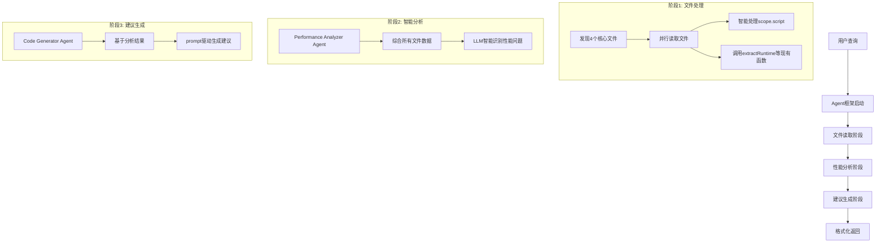

# SCOPE AI Agent框架设计文档

## 1. 概述

### 1.1 项目目标
构建一个智能的AI Agent框架，能够自动分析SCOPE作业的性能问题，并提供具体的代码优化建议。

### 1.2 核心功能
- 自动识别和读取SCOPE作业文件
- 智能分析性能瓶颈
- 生成具体的代码优化建议
- 提供原代码与修改代码的对比
- 与VS Code LLM模型无缝集成

### 1.3 技术架构
采用多Agent协作框架，结合工具调用系统，实现自动化的性能分析和优化建议生成。

## 2. 系统架构设计

### 2.1 整体架构图

```
┌─────────────────────────────────────────────────────────────┐
│                    VS Code Extension                        │
│  ┌─────────────────┐    ┌─────────────────────────────────┐ │
│  │   Chat UI       │    │     Extension Controller        │ │
│  │                 │◄──►│                                 │ │
│  └─────────────────┘    └─────────────────────────────────┘ │
└─────────────────────────────┬───────────────────────────────┘
                              │
                              ▼
┌─────────────────────────────────────────────────────────────┐
│                 AI Agent Framework                          │
│  ┌─────────────────────────────────────────────────────────┐ │
│  │                Agent Orchestrator                       │ │
│  │  ┌─────────────┐ ┌─────────────┐ ┌─────────────────────┐ │ │
│  │  │  Coordinator │ │  Planner    │ │  ExecutionManager   │ │ │
│  │  │   Agent     │ │   Agent     │ │                     │ │ │
│  │  └─────────────┘ └─────────────┘ └─────────────────────┘ │ │
│  └─────────────────────────────────────────────────────────┘ │
│  ┌─────────────────────────────────────────────────────────┐ │
│  │                Specialized Agents                       │ │
│  │  ┌─────────────┐ ┌─────────────┐ ┌─────────────────────┐ │ │
│  │  │ File Reader │ │ Performance │ │ Code Generator      │ │ │
│  │  │   Agent     │ │ Analyzer    │ │     Agent           │ │ │
│  │  └─────────────┘ └─────────────┘ └─────────────────────┘ │ │
│  └─────────────────────────────────────────────────────────┘ │
│  ┌─────────────────────────────────────────────────────────┐ │
│  │                   Tool System                           │ │
│  │  ┌─────────────┐ ┌─────────────┐ ┌─────────────────────┐ │ │
│  │  │File Readers │ │ Analyzers   │ │ Code Processors     │ │ │
│  │  └─────────────┘ └─────────────┘ └─────────────────────┘ │ │
│  └─────────────────────────────────────────────────────────┘ │
└─────────────────────────────────────────────────────────────┘
                              │
                              ▼
┌─────────────────────────────────────────────────────────────┐
│                 SCOPE Job Files                             │
│  ┌─────────────┐ ┌─────────────┐ ┌─────────────────────────┐ │
│  │ .script     │ │ .xml        │ │    .json/.csv/.log      │ │
│  │   files     │ │  files      │ │       files             │ │
│  └─────────────┘ └─────────────┘ └─────────────────────────┘ │
└─────────────────────────────────────────────────────────────┘
```

### 2.2 核心组件

#### 2.2.1 Agent Framework Core
- **Agent Orchestrator**: 协调多个Agent的工作
- **Message Bus**: Agent间通信机制
- **Context Manager**: 管理共享上下文和状态
- **Error Handler**: 统一错误处理和恢复

#### 2.2.2 Specialized Agents
- **Coordinator Agent**: 总协调员，分配任务
- **Planner Agent**: 制定分析计划
- **File Reader Agent**: 负责读取和解析文件
- **Performance Analyzer Agent**: 性能分析专家
- **Code Generator Agent**: 代码优化建议生成

#### 2.2.3 Tool System
- **File Tools**: 文件读取和解析工具
- **Analysis Tools**: 性能分析工具
- **Code Tools**: 代码生成和对比工具

## 3. Agent框架选择

### 3.1 框架对比

| 框架 | 优势 | 劣势 | 适用性 |
|------|------|------|--------|
| **AutoGen** | 多Agent协作成熟、对话式编程 | 学习曲线、资源消耗 | ⭐⭐⭐⭐⭐ |
| **LangChain** | 工具集成丰富、生态成熟 | 相对复杂、版本变化快 | ⭐⭐⭐⭐ |
| **自定义框架** | 完全可控、轻量化 | 开发量大、维护成本高 | ⭐⭐⭐ |

### 3.2 推荐方案：混合方案

采用**AutoGen作为主框架**，结合**自定义工具系统**：

- 使用AutoGen的多Agent协作能力
- 自定义SCOPE特定的工具和分析逻辑
- 保持架构的灵活性和扩展性

## 4. 文件定义系统

### 4.1 文件类型定义

```typescript
interface SCOPEFileDefinition {
    fileType: string;              // 文件类型标识
    pattern: RegExp;               // 文件名匹配模式
    description: string;           // 文件描述
    readerTool: string;           // 对应的读取工具
    priority: number;             // 分析优先级 (1-10, 10最高)
    category: 'script' | 'generated' | 'statistics' | 'execution_plan' | 'metadata' | 'diagnostics' | 'profiling';
    required: boolean;            // 是否必需文件
    processingStrategy: string;   // 处理策略
}

// 处理策略枚举
enum ProcessingStrategy {
    INTELLIGENT_SEGMENTATION = 'intelligent_segmentation',  // 智能分段，保留关键代码
    SUMMARY_WITH_KEY_METHODS = 'summary_with_key_methods', // 总结+关键方法
    STRUCTURED_EXTRACTION = 'structured_extraction',       // 结构化数据提取
    VERTEX_ANALYSIS = 'vertex_analysis',                   // 顶点分析
    BASIC_INFO_EXTRACTION = 'basic_info_extraction',       // 基础信息提取
    PLAN_ANALYSIS = 'plan_analysis',                       // 执行计划分析
    WARNING_CATEGORIZATION = 'warning_categorization',     // 警告分类
    RUNTIME_ANALYSIS = 'runtime_analysis',                 // 运行时分析
    ERROR_ANALYSIS = 'error_analysis',                     // 错误分析
    PERFORMANCE_PROFILING = 'performance_profiling'        // 性能画像
}
```

### 4.2 预定义文件类型

```typescript
const SCOPE_FILE_DEFINITIONS: SCOPEFileDefinition[] = [
    // 核心分析文件（优先级最高的4个文件）
    {
        fileType: "SCOPE_SCRIPT",
        pattern: /^scope\.script$/i,
        description: "用户提交的原始SCOPE脚本代码",
        readerTool: "SCOPEScriptIntelligentReader", // 智能读取，保留关键代码段
        priority: 10,
        category: 'script',
        required: true,
        processingStrategy: 'intelligent_segmentation' // 智能分段策略
    },
    
    {
        fileType: "CODEGEN_CS",
        pattern: /^__ScopeCodeGen__\.dll\.cs$/i,
        description: "生成的C#源代码，包含编译时生成的所有执行逻辑",
        readerTool: "CSCodeReader",
        priority: 9,
        category: 'generated',
        required: true,
        processingStrategy: 'summary_with_key_methods'
    },
    
    {
        fileType: "JOB_STATISTICS",
        pattern: /^JobStatistics\.xml$/i,
        description: "作业执行完成后的统计信息，包括每个阶段执行时长、数据量统计等",
        readerTool: "extractRuntime", // 使用现有函数
        priority: 9,
        category: 'statistics',
        required: true,
        processingStrategy: 'structured_extraction'
    },
    
    {
        fileType: "VERTEX_DEFINITION",
        pattern: /^ScopeVertexDef(\.xml)?$/i,
        description: "定义作业中的各个计算节点（Vertex）的详细配置信息和参数",
        readerTool: "extractVertex", // 使用现有函数
        priority: 8,
        category: 'execution_plan',
        required: true,
        processingStrategy: 'vertex_analysis'
    },
    
    // 补充分析文件
    
    
    {
        fileType: "RUNTIME_STATS",
        pattern: /^__ScopeRuntimeStatistics__\.xml$/i,
        description: "作业执行期间运行时的详细统计数据",
        readerTool: "extractRuntime2", // 使用现有函数
        priority: 6,
        category: 'statistics',
        required: false,
        processingStrategy: 'runtime_analysis'
    },
    
    {
        fileType: "ERROR_INFO",
        pattern: /^Error$/i,
        description: "作业执行过程中的错误详细信息",
        readerTool: "ErrorLogReader",
        priority: 8,
        category: 'diagnostics',
        required: false,
        processingStrategy: 'error_analysis'
    },
    
];
```

## 5. 工具系统设计

### 5.1 工具接口定义

```typescript
interface AnalysisTool {
    name: string;
    description: string;
    category: ToolCategory;
    
    // 工具能力声明
    canHandle(fileType: string): boolean;
    
    // 执行工具
    execute(input: ToolInput): Promise<ToolOutput>;
    
    // 工具配置
    configure(config: ToolConfig): void;
}

interface ToolInput {
    filePath: string;
    fileType: string;
    analysisGoal: string;
    context?: AnalysisContext;
}

interface ToolOutput {
    success: boolean;
    data: any;
    metadata: ToolMetadata;
    errors?: string[];
    suggestions?: string[];
}
```

### 5.2 具体工具实现

#### 5.2.1 SCOPE脚本智能读取工具

**核心挑战**: 既要保留关键代码细节不被LLM忽略，又要控制token消耗

```typescript
class SCOPEScriptIntelligentReader implements AnalysisTool {
    name = "SCOPEScriptIntelligentReader";
    description = "智能读取SCOPE脚本，平衡完整性与token效率";
    category = ToolCategory.FILE_READER;
    
    async execute(input: ToolInput): Promise<ToolOutput> {
        // 智能分段策略
        const segments = await this.intelligentSegmentation(scriptContent);
        
        return {
            success: true,
            data: {
                // 分段保留策略
                criticalSections: segments.critical,     // 完整保留的关键代码段
                summarizedSections: segments.summarized, // 总结的常规代码段
                performanceHotspots: segments.hotspots,  // 性能敏感区域
                codeStructure: segments.structure        // 整体结构概览
            },
            metadata: {
                totalLines: scriptContent.split('\n').length,
                criticalLines: segments.critical.totalLines,
                tokenEstimate: this.estimateTokens(segments)
            }
        };
    }
    
    // 智能分段算法
    private async intelligentSegmentation(content: string) {
        // 1. 识别性能关键区域 (JOIN, GROUP BY, 大数据处理等)
        // 2. 识别复杂查询逻辑
        // 3. 识别可能存在问题的代码模式
        // 4. 对非关键区域进行智能总结
        // 5. 保持代码上下文的连贯性
    }
}
```

**分段策略详解**:

1. **完整保留区域** (Critical Sections)
   - JOIN操作及其上下文
   - GROUP BY和聚合操作
   - 大数据量处理的循环
   - 复杂的数据转换逻辑
   - 自定义函数定义

2. **总结保留区域** (Summarized Sections)  
   - 简单的数据读取操作
   - 标准的数据清洗逻辑
   - 变量声明和初始化
   - 注释和文档

3. **性能热点区域** (Performance Hotspots)
   - 嵌套查询
   - 缺少索引的查找
   - 可能导致数据倾斜的操作
   - 资源密集型计算

4. **结构概览** (Code Structure)
   - 主要流程步骤
   - 数据流向图
   - 关键变量和表名映射

#### 5.2.2 性能日志分析工具

```typescript
class PerformanceLogAnalyzer implements AnalysisTool {
    name = "PerformanceLogAnalyzer";
    description = "分析作业执行日志中的性能指标";
    category = ToolCategory.ANALYZER;
    
    async execute(input: ToolInput): Promise<ToolOutput> {
        // 1. 解析日志文件
        // 2. 提取时间戳和性能指标
        // 3. 识别执行时间异常
        // 4. 分析资源使用模式
        return {
            success: true,
            data: {
                executionTimes: {},  // 执行时间统计
                resourceUsage: {},   // 资源使用情况
                errorPatterns: {},   // 错误模式
                recommendations: []  // 优化建议
            },
            metadata: { /* ... */ }
        };
    }
}
```

#### 5.2.3 代码优化建议生成器

```typescript
class CodeOptimizationGenerator implements AnalysisTool {
    name = "CodeOptimizationGenerator";
    description = "基于分析结果生成具体的代码优化建议";
    category = ToolCategory.CODE_GENERATOR;
    
    async execute(input: ToolInput): Promise<ToolOutput> {
        // 1. 整合所有分析结果
        // 2. 识别优化机会
        // 3. 生成具体的代码修改建议
        // 4. 创建before/after对比
        return {
            success: true,
            data: {
                optimizations: [
                    {
                        type: "索引优化",
                        location: "第15行",
                        original: "原始代码",
                        optimized: "优化后代码",
                        reason: "优化原因",
                        impact: "预期性能提升"
                    }
                ]
            },
            metadata: { /* ... */ }
        };
    }
}
```

## 6. Agent工作流程设计

### 6.1 简化的工作流程

**核心原则**: 避免过多嵌套，保持流程清晰，返回值明确



**流程详解**:

1. **文件发现与读取** (单一职责，返回结构化数据)
   - 输入: job文件夹路径
   - 处理: 找到4个核心文件，调用对应读取工具
   - 输出: `{scriptData, statisticsData, vertexData, codegenData}`

2. **性能分析** (Agent驱动，智能分析)  
   - 输入: 上一步的结构化数据
   - 处理: Performance Analyzer Agent通过LLM综合分析
   - 输出: `{identifiedIssues, performanceBottlenecks, analysisInsights}`

3. **建议生成** (Prompt驱动，格式化输出)
   - 输入: 分析结果
   - 处理: Code Generator Agent生成标准格式建议
   - 输出: `{optimizationSuggestions, codeComparisons, implementationGuide}`

### 6.2 Agent间通信协议

```typescript
interface AgentMessage {
    id: string;
    from: string;
    to: string;
    type: MessageType;
    payload: any;
    timestamp: Date;
    priority: Priority;
}

enum MessageType {
    TASK_ASSIGNMENT = "TASK_ASSIGNMENT",
    DATA_SHARING = "DATA_SHARING",
    ANALYSIS_RESULT = "ANALYSIS_RESULT",
    REQUEST_ASSISTANCE = "REQUEST_ASSISTANCE",
    COMPLETION_NOTICE = "COMPLETION_NOTICE"
}
```

### 6.3 Context共享机制

```typescript
interface AnalysisContext {
    jobId: string;
    jobPath: string;
    discoveredFiles: DiscoveredFile[];
    analysisGoals: string[];
    intermediateResults: Map<string, any>;
    sharedKnowledge: KnowledgeBase;
    executionPlan: ExecutionStep[];
    currentStep: number;
}
```

## 7. 性能分析策略

### 7.1 分析维度

| 维度 | 分析内容 | 主要文件来源 | Agent负责 |
|------|----------|------|----------|
| **代码结构** | SCOPE语法、数据流、操作复杂度 | scope.script, __ScopeCodeGen__.dll.cs | Performance Analyzer Agent |
| **执行性能** | 运行时间、内存使用、执行效率 | JobStatistics.xml, ScopeVertexDef | Performance Analyzer Agent |
| **数据处理** | 数据量、分区策略、算子选择 | Algebra.xml, ScopeVertexDef | Performance Analyzer Agent |

### 7.2 Agent驱动的智能分析

Performance Analyzer Agent通过LLM智能分析各个维度的性能问题，而不是依赖硬编码规则：

#### 7.2.1 代码结构分析
- **输入**: scope.script原始代码 + __ScopeCodeGen__.dll.cs生成代码
- **Agent任务**: 识别复杂查询、低效JOIN、缺失索引等代码层面问题
- **分析方法**: LLM理解SCOPE语法，找出潜在性能瓶颈模式

#### 7.2.2 执行性能分析  
- **输入**: JobStatistics.xml执行统计 + ScopeVertexDef顶点定义
- **Agent任务**: 识别慢顶点、资源浪费、执行时长异常等运行时问题
- **分析方法**: LLM分析执行时间分布，找出异常耗时的操作

#### 7.2.3 数据处理分析
- **输入**: Algebra.xml查询计划 + ScopeVertexDef数据流信息  
- **Agent任务**: 识别数据倾斜、分区不当、算子选择不优等数据处理问题
- **分析方法**: LLM理解查询计划结构，发现数据处理效率问题

#### 7.2.4 Agent协作流程
```
File Reader Agent → 读取4个核心文件
         ↓
Performance Analyzer Agent → 接收所有文件数据，进行综合智能分析
         ↓  
Code Generator Agent → 基于分析结果生成具体优化建议
```

## 8. 代码建议生成系统

### 8.1 Prompt驱动的建议格式

Code Generator Agent通过精心设计的prompt来生成标准化的优化建议，无需硬编码类定义：

#### 8.1.1 建议生成Prompt模板

```
SCOPE (Structured Computation Optimized for Parallel Execution) is a SQL-like scripting language for big data processing in Microsoft Cosmos. 你是SCOPE性能优化专家。基于以下分析结果，生成具体的代码优化建议。

**输出格式要求：**
对每个优化建议，请按以下格式输出：

## 优化建议 {编号}: {标题}

**问题描述**: {详细描述发现的性能问题}

**优化类型**: [索引优化/查询重写/分区优化/JOIN优化/其他]

**优先级**: [高/中/低]

**代码对比**:
```scope
// 原始代码 (第{行号}行)
{原始SCOPE代码}

// 优化后代码  
{优化后SCOPE代码}
```

**优化说明**: {解释为什么这样修改能提升性能}

**预期效果**: 
- 性能提升: {具体数值或百分比}
- 资源节省: {内存/CPU/时间节省情况}

**实施步骤**:
1. {步骤1}
2. {步骤2}
...

**注意事项**: {实施时需要注意的风险或限制}

---
```

#### 8.2.2 智能优化识别

Agent通过LLM智能识别优化机会，而不是依赖预定义模式：

- **动态分析**: 根据具体代码和性能数据，灵活识别优化点
- **上下文感知**: 考虑整个查询的上下文，提供最适合的优化方案  
- **多维度考虑**: 综合代码复杂度、数据特征、执行统计等多个因素
- **个性化建议**: 针对特定job的特点，生成定制化的优化建议

## 9. 与VS Code LLM集成

### 9.1 接口设计

```typescript
interface VSCodeLLMInterface {
    /**
     * 接收用户查询
     */
    receiveUserQuery(query: string): Promise<void>;
    
    /**
     * 返回分析结果
     */
    returnAnalysisResult(result: AnalysisResult): Promise<void>;
    
    /**
     * 流式返回进度更新
     */
    streamProgressUpdate(update: ProgressUpdate): Promise<void>;
}
```

### 9.2 结果格式化

```typescript
class ResultFormatter {
    /**
     * 格式化为Markdown报告
     */
    formatAsMarkdown(result: AnalysisResult): string;
    
    /**
     * 生成代码对比视图
     */
    generateCodeComparison(suggestions: CodeOptimizationSuggestion[]): string;
    
    /**
     * 创建交互式建议列表
     */
    createInteractiveSuggestions(suggestions: CodeOptimizationSuggestion[]): string;
}
```
###9.3 清除不需要的文件
清除冗余或不需要的文件，保持文件目录结构清晰，框架清晰，函数调用不复杂。

---

这个框架设计提供了一个完整的、可扩展的AI Agent系统，能够满足您对SCOPE作业性能分析和优化建议生成的需求。接下来我们可以开始实施具体的代码开发工作。 